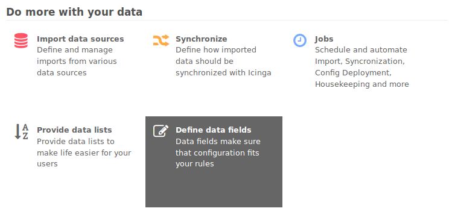
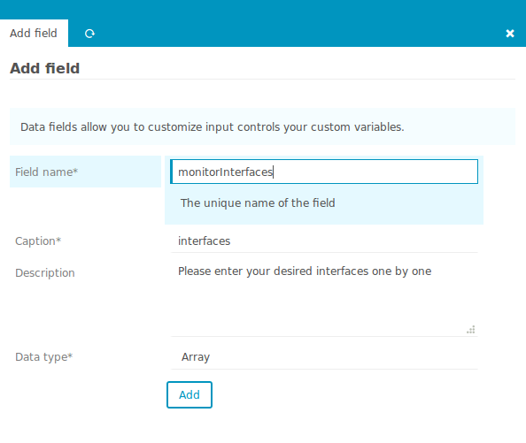
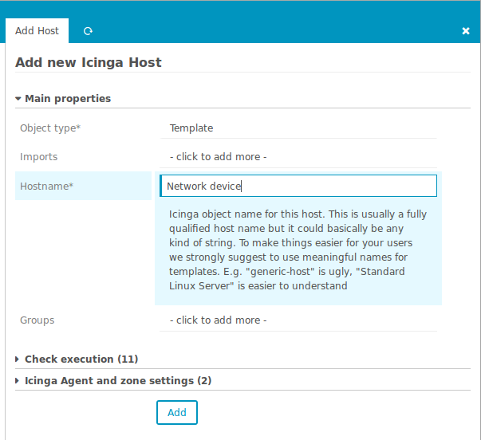
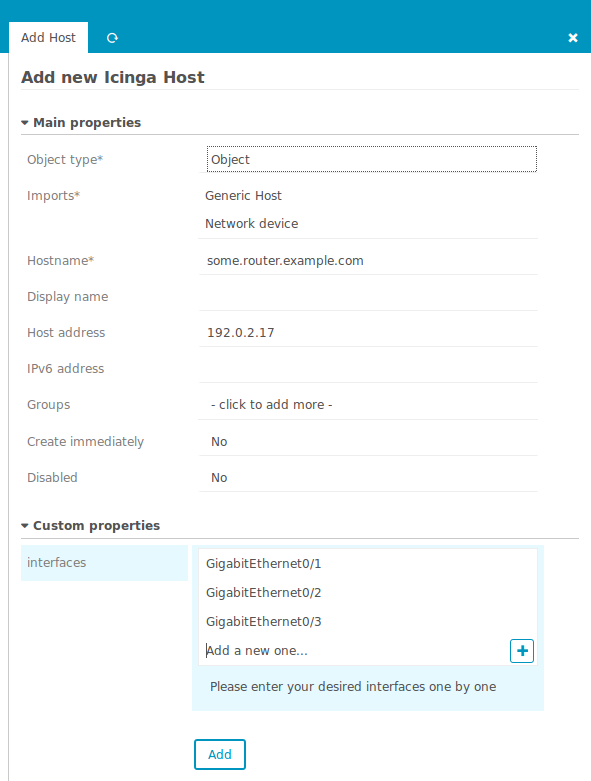
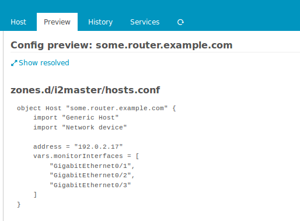

Working with fields - interfaces array example
==============================================

This example wants to show you how to make use of the `Array` data type
when creating fields for custom variables. First, please got to the `Dashboard`
and choose the `Define data fields` dashlet:

Then create a new data field and select `Array` as it's data type:

Then create a new `Host template` (or use an existing one):

Now add your formerly created data field to your template:

That's it, now you are ready to create your first corresponding host. Once
you add your formerly created template, a new form field for your custom
variable will show up:

Have a look at the config preview, it will show you how your `Array`-based
custom variable will look like once deployed:

